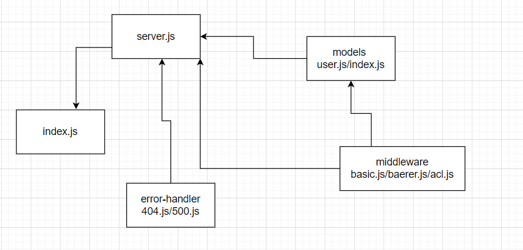

# auth-api

# bearer-auth

[heroku link](https://leen-auth-api.herokuapp.com/)

 >>> add username and password >>>  **POST**

 >>> signin with the username and password >>> **POST**

 >>> add token >>> **GET**

[pull link](https://github.com/leenahmad/auth-api/pull/1)

[action link]()

## UML 

